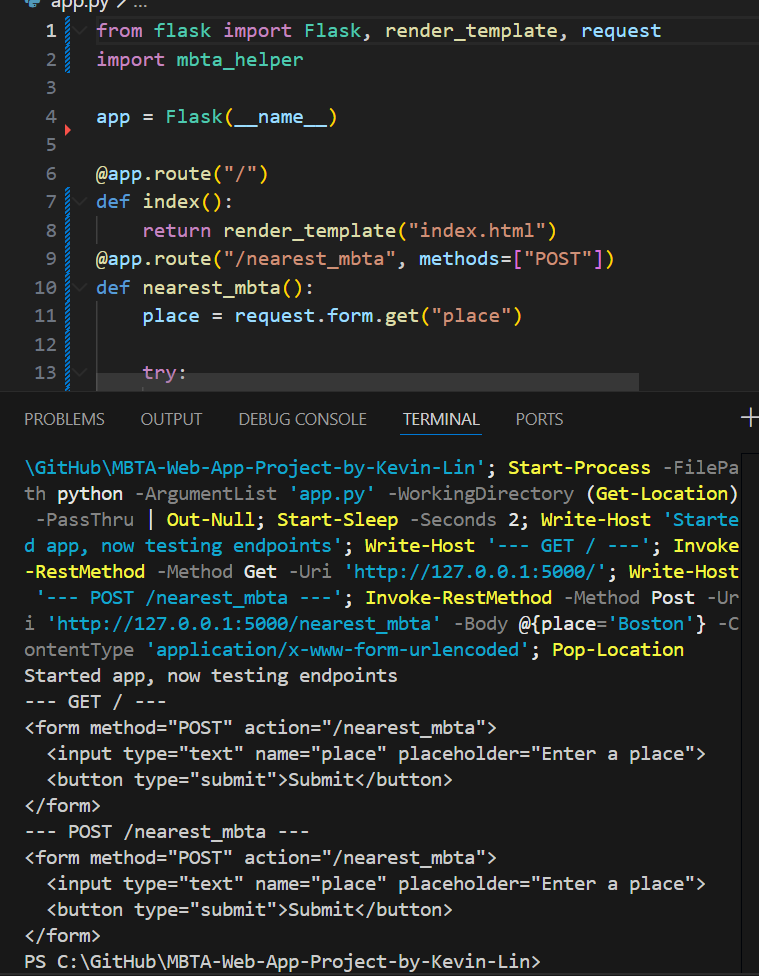

# MBTA-Web-App-Project

This is the base repository for Web App project. Please read the [instructions](instructions.md) for details.

# Team Members: Kevin Lin
# Project Overview
# Goal: It helps people find the nearest MBTA train station near them and if it's wheelchair accessible.
# Core Features: Able to tell the nearest MBTA Station near you and if it's wheelchair accessible.
# I added a wheelchair option to make the project useful to more people.
# Reflection: Debugging process was better than before. I reflected on the notes in class and if it was something small or a simple error; I'd usually be able to fit it without help. When it came to writing the code completely wrong or messing up a more complex function. API Errors were the hardest for me and when it involved the APIs and flask too. I approached problem-solving by looking at my notes and previous homeworks. If the framework or outline of the code was there, I could fix it by myself. If I had to do this project myself again, I'd try to do it more myself with the more complex things through asking my professor and tutor for assistance. To make sure I understood, what I learned, I would try to make lines of code that made sure I understood what it did and why. 

# Management of Tasks: I handled the tasks by first using the guidelines and notes provided to get a headstart and try to understand what the end product should be like. I then tried to write the code as much as I could by myself and with a friend helping me along the way. I focused first on getting the ApIs to work then the flash and lastly the accesiblity feature. At the end, I tested it and tried to fix the errors thati could fix using my knowledge of my notes to figure it out and a little bit of vibe coding. The more complex ones like when I missed up the API and formatting of it, I used CHATGPT to fix it and looked over the changes. 
# Learning and Use of AI: I learned the basics of APIs and how they are used. You have to define them beforehand to use and is tied specifically to an account of own process. Flask is a website and in code terms you try to put the data you want displayed on it. A template can help with the formatting side and streamline the process. A lot of the errors was mainly the formatting and I would rather mistype and not place the code correctly. Debugging with my notes really helped as I could see the format in real-time and double-check what was wrong. Integrating modules you to make surw you download and import what's neccesary. I used ChatGPT and Github. I feel ChatGPT was good at fixing problems, but would create one sometimes. For every 5 fixed, one would be created. This wasn't a big issue since I could ask ChatGPT again and usually was something small, so I could even fix it myself. AI helped me with unfamilar labiraies and how to import them, troubleshooting, and code review. It helped me streamline the process and  helped when there was simulatenous errors especialy ones I couldn't fix myself. I noticed ChatGPT has issues with pulling my own API which makes sense since only i would know and I would have to put it in the code for it to use. it would assign a placeholder usually. I wish I had known what libraries could be used as that would help me be more creative with the project.

